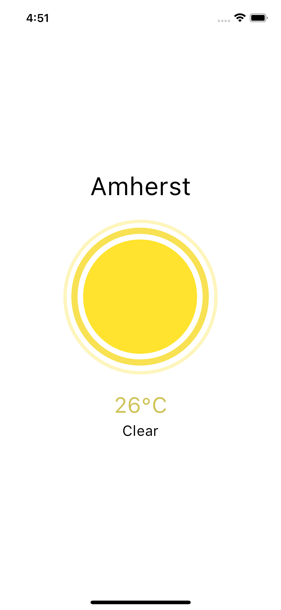
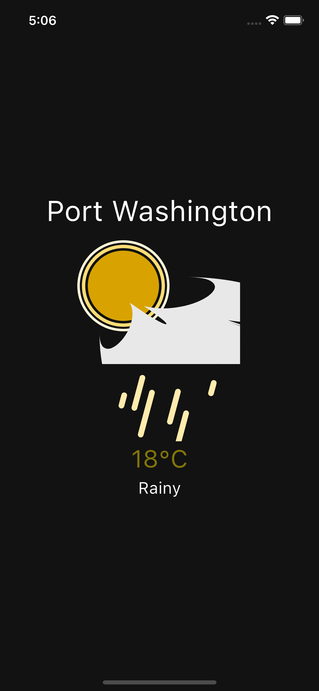

# Minimalistic_WeatherApp

My minimalistic weather app based on flutter  
  
**Added Features:**  
1. API Consumed: openweathermap  
2. Lotti Animations - to depict the current weather in a fun way  
3. Added Darkmode\Lightmode - Dependent on default phone setting

## Working Images
 
## Getting Started

You can clone this repository and run the main.dart file in any emulator to see the app working

## Prior Setting
**Location:** Keep in mind the application will use the custom location set by the emulator  
**Darkmode\lightmode:** This too is dependend on the setting of the emualtor
